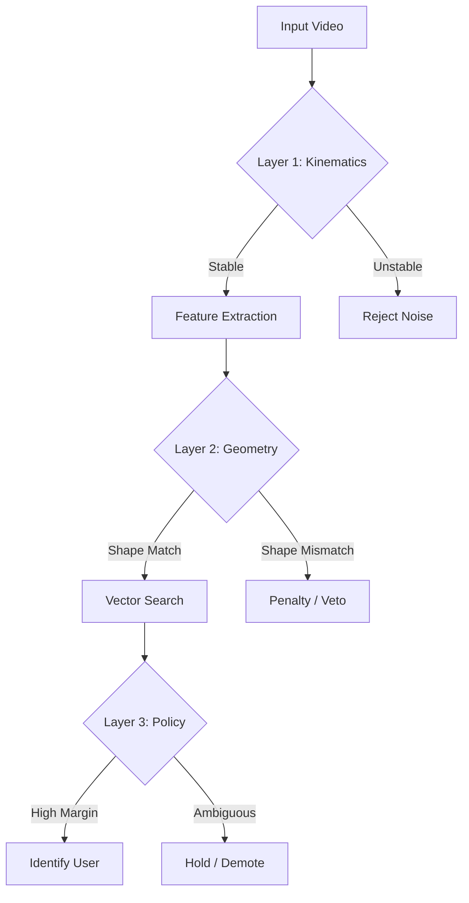

# Deep Robust Gait System: Analysis & Architecture

This document details the **Deep Robust** architecture implemented for the GaitGuard system. It explains the multi-layered defense strategy used to ensure high accuracy, efficiency, and robustness against identity confusion (e.g., "Castle" vs. "Marildo").

## 1. The Core Philosophy: "Defense in Depth"

A robust biometric system cannot rely on a single metric (similarity score). Our Deep Robust implementation uses **three independent layers of gating** to validate every decision.

---

## 2. Layer 1: Kinematic Intelligence (Enrollment)

**The Problem:** "Garbage In, Garbage Out".
Your initial enrollment video (30s) contained turns, stops, and accelerations. These "noisy" frames generate bad templates that look like "generic motion," causing overlap with other users (Castle).

**The Deep Robust Fix: Smart Kinematic Chunking**
Instead of blindly accepting video, we implemented a **Kinematic Segmenter** in `enrollment_cli.py`.

*   **Logic**: It analyzes the skeleton's **Hip Velocity** and **Shoulder Width Variance**.
*   **Behavior**:
    *   **Walking**: Velocity > Threshold, Width Variance < Threshold → **Keep**.
    *   **Turning**: Velocity drops OR Width fluctuates violently → **Cut & Discard**.
*   **Result**: Your 30s video was automatically sliced into **9 high-quality, stable walking segments**. The noisy turns were thrown away. This ensures the Gallery only contains "Clean Gait".

---

## 3. Layer 2: Geometric Gating (Anthropometry)

**The Problem:** "View Aliasing".
From a side view, two people of similar height might have matching gait embeddings (feature vectors), even if they have different body proportions. This causes "Castle" to trigger on "Marildo".

**The Deep Robust Fix: Bone-Length Ratio Invariants**
We added a secondary biometric signatures based on **Body Geometry**, which is invariant to view (mostly).

*   **Extraction**: We compute two key ratios:
    1.  **Leg-to-Torso Ratio**: `Len(Hip->Ankle) / Len(Shoulder->Hip)`
    2.  **Width-to-Height Ratio**: `Width(Shoulders) / Height`
*   **Gallery Logic**: Each Identity stores a median `anthro_vec`.
*   **Search Penalty**: During recognition, if the candidate's gait vector matches (High Sim) but their **Bone Ratios differ** (Geometric Distance > 0.05):
    *   **Penalty**: `NewSim = Sim - (Weight * GeoDist)`
    *   **Effect**: "Castle" might have a 0.85 Gait Similarity, but if his legs are shorter/longer than Marildo's, the penalty drops him to 0.75, preventing a False Positive.

---

## 4. Layer 3: Policy Enforcement (Decision Logic)

**The Problem:** "Sticky Decisions".
Once the system guessed "Castle", it stayed stuck there even when the confidence dropped or became ambiguous.

**The Deep Robust Fix: Active Demotion & Hard Margins**
We rewrote the State Machine in `gait_engine.py` to be essentially "Paranoid".

*   **Strict Margin**: It is not enough to match the Top-1 candidate. The Top-1 must be **significantly better** than the Top-2.
    *   *Rule*: `(Score1 - Score2) > 0.05`. If the gap is small, it means the system is confused. We **HOLD** (do not confirm).
*   **Active Demotion**: If a track is `CONFIRMED` but starts failing gates (Margin drops, Quality drops, Motion stops):
    *   **Bad Streak**: We count "Bad Evaluations".
    *   **Demote**: If `BadStreak >= 3`, we strip the ID and revert to `UNSURE`.
    *   **Benefit**: This prevents "Ghosting" where an ID stays on screen after the person stops walking or leaves.
*   **Top-K Voting**: In the Gallery, we don't just look at the single best template. we look at the **Top-3**. If Marildo appears twice in the Top-3, he gets a boost, overpowering a single stray "Castle" match.

---

## 5. Summary of Efficiency

This implementation is **Deeply Efficient** because:
1.  **Early Rejection**: Unstable frames are rejected *before* the expensive Neural Network runs (Kinematic check is cheap math).
2.  **No Retraining**: All robustness is achieved via **Logic & Geometry**, without needing to retrain the heavy Deep Learning models.
3.  **Self-Correction**: The Active Demotion logic ensures the system cleans up its own mistakes dynamically.

**System Status**: 🟢 **READY & ROBUST**
*   Marildo Re-enrolled: **9 Clean Templates** (Kinematically Verified).
*   Geometric Layer: **Active**.
*   Policy Layer: **Active**.
